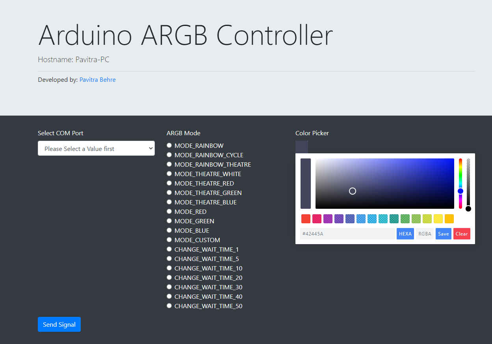
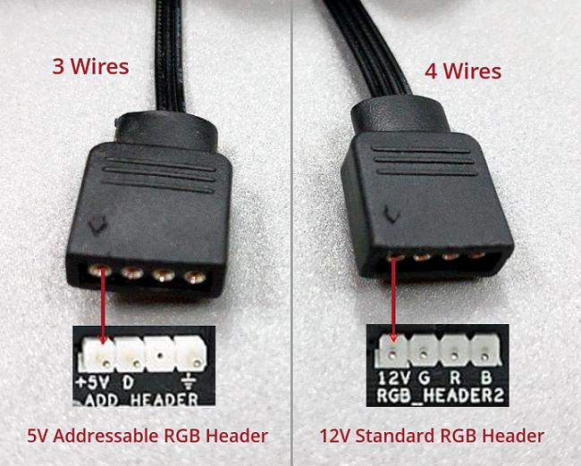
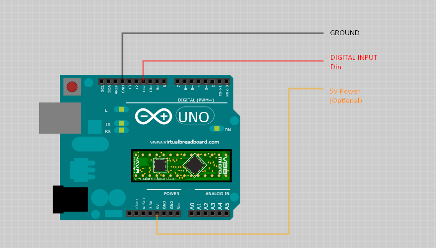
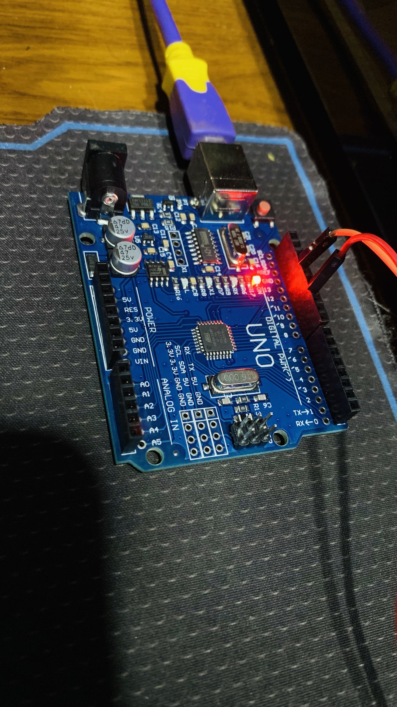

# Arduino ARGB Controller
This project helps people with ARGB computer components to control the lighting effects using a Arduino Device(Uno) in our case.



Works best with 3 pin rgb sync connectors.

3 pins:
 - Digital Input
 - Ground
 - Volt (5v)


Usually ARGB Fans have power from a central LED Controller in your PC Cabinet, so you only need to connect the Ground and Digital Input to your Arduino Board.
Kindly check with your manufacturer for the correct details.

## How it works?
1. We use Adafruit Library to Control the LEDs
2. Arduino listens on a Serial port for communication with PC
3. Flask App acts like a GUI Frontend to control modes on arduino.

## Arduino Set up
Make sure you have the following libraries in Arduino Installed
- [Adafruit Neopixel Library](https://github.com/adafruit/Adafruit_NeoPixel)



My Setup (Digital Pin Connected to Pin 11)


Navigate to sketch_aug06a.ino inside sketch_aug06a folder and edit the following lines to suit your needs
```C
//Config Values
#define PIN 11
#define PIXELS 60
```
Upload the file to your arduino board.


## Installation

Use the package manager [pip](https://pip.pypa.io/en/stable/) to install dependencies.

```bash
pip install -r requirements.txt
```

## Usage

```sh
#Just put a shortcut to arduino_controller.bat in your system startup
#Alternatively
python run.py
#or if you want to run in background 
pythonw run.py

#Using the bat file is recommended for windows systems
```

## Contributing
Pull requests are welcome. For major changes, please open an issue first to discuss what you would like to change.

Please make sure to test your changes as appropriate.

## License
[MIT](LICENSE.md)